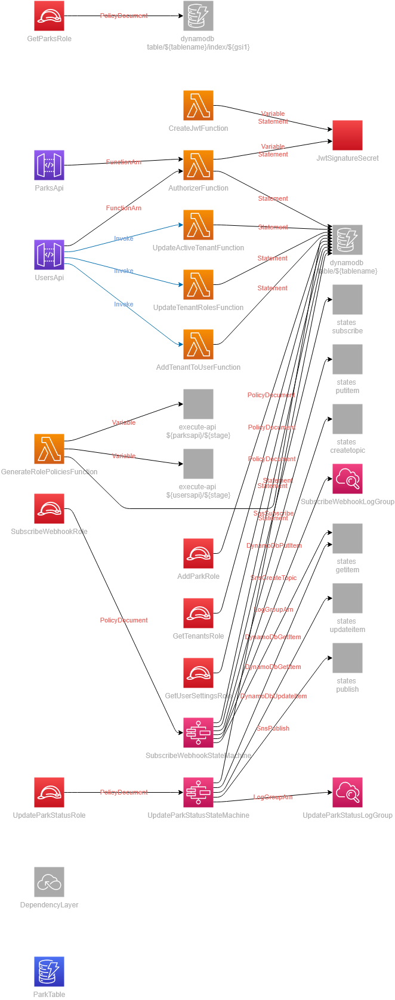

# Serverless Multi-tenancy Reference Architecture
Example architecture of a serverless multi-tenant environment.

## Description

This repository builds a multi-tenant application for managing state parks. Tenants are scoped to individual states from the United States. When invoking the API, your user will be associated to a single tenant (state) at a time. The tenant you are active under will determine the results in the API responses.

This repo has a [Postman collection](https://www.postman.com/allenheltondev/workspace/serverless/collection/16041239-d1cccc8a-21ba-45ce-9143-9f1353d94b5b?ctx=documentation) publicly available to help view what these APIs offer. You will need to update the collection variables with the output from this stack on deploy.

### Resources

This repo deploys two separate apis. A `parks` api and a `users` api. The `parks` api is used as a standard application api for the data plane. You can add and update parks via this API.

The `users` api is for the control plane. It allows the user to modify tenant settings for themselves. This api is important because it enables you to verify the data isolation on a tenant level. Being able to change your tenant or roles associated to the tenant will enable you to test different settings and combinations around access control.

## Multi-tenancy

When multi-tenancy is discussed in this repository, it means the *mechanism of data isolation*. All data is scoped to a tenant and is only visible when the caller is actively using that tenant.

To achieve multi-tenancy, we prefix the tenantId on all data objects in DynamoDB. We do this for both the partition key and all GSIs. So when loading a park out of DynamoDB, the partition key would be structured `${tenantId}#${parkId}`. 

The tenantId is inferred from the JWT. Our custom authorizer does a lookup on all calls to get the user information from the system. It then adds the active tenant id to the authorizer context which is passed downstream to state machine workflows, Lambda functions, or VTL integrations with DynamoDB.

This mechanism allows safe tenancy by preventing the user from spoofing a tenant id in the request. Since the tenant is loaded via the authentication mechanism, we can feel confident we are applying proper access control.

## Authentication

This repository uses a Lambda authorizer to determine access. The application has a set of predefined '*system roles*' that determines the endpoints a user can or cannot hit.

**Roles**
* `admin` - Application administrator. This user can add, update, and get park details.
* `member` - Standard user with rights. This user can add new parks and get park details.
* `visitor` - Standard end user. This user can get park details and register for webhook events.

A user can be assigned one or more roles per tenant (also known as customer in this solution). The roles may differ per tenant, meaning you could have the `visitor` role in one tenant, but `admin`, `member`, and `visitor` in another. 

Role access is additive, meaning if you have all roles you will be able to access all endpoints. Explicit denies are overridden by explicit allows based on the assigned roles.

## Getting Started

After deployment there are a couple of tasks you must perform in order for the solution to work properly.

### Seed your user

Using the example from `/functions/authorizer/examples/user.json` you can create your use in DynamoDB by running the following command in a terminal at the root of the repository after you have deployed the stack.

```bash
aws dynamodb put-item --table-name parks --item file://functions/authorizer/examples/user.json
```

### Update access policies

A custom Lambda authorizer is used for auth in this solution. A Lambda authorizer returns a policy document as its return object which includes the routes allowed to be invoked.

The routes are statically defined, but upon deploy the API is dynamically generated (meaning the API id for you is different than mine). So we use a Lambda function to generate the policy and store it off in Dynamo for the authorizer to load upon invocation.

```bash
aws lambda invoke --function-name GenerateRolePolicies output.json
```

You do not need to consume the output of the function, it is going to update a resource consumed by the authorizer. If you extend either API in this repository, you will need to update the `generate-role-policies` function to include the route and allowed roles.

### Get an auth token

You will need to create an auth token in order to hit the endpoints. The `create-jwt` Lambda function will generate a jwt for you to pass into API requests. Use the following command to generate a token:

```bash
aws lambda invoke --function-name CreateJwtFunction jwt.json
```

Once the function has completed, you can grab the content from the `jwt.json` file that was generated and pass it in as a bearer token to the APIs. 

Provide the `Authorization` header with a value of `Bearer {value generated from the lambda function}` to successfully authenticate.

## Architecture

Below are all the resources that get deployed to your AWS account upon a successful deploy.

